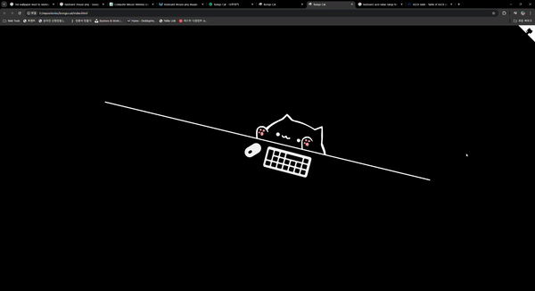
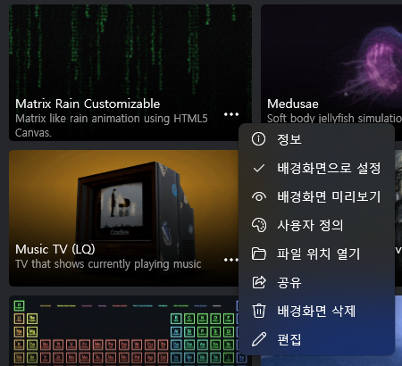

# Bongo Cat - Lively Wallpaper
Modified using resources from [bongo.cat](https://github.com/Externalizable/bongo.cat)

    

- All the sounds has removed

- All Instruments has removed

- Scripts has modified to fit with keyboard and mouse

## 설치 방법
#### 1. Lively Wallpaper 설치
MS 스토어 [링크](https://apps.microsoft.com/detail/9ntm2qc6qws7?hl=ko-kr&gl=US)에서 라이브 월페이퍼 프로그램 설치

#### 2. 기본 월페이퍼 폴더 확인
- 라이브 월페이퍼 기본 폴더는 아래와 같은 되어 있음
C:\Users\{사용자 아이디}\AppData\Local\Packages\12030rocksdanister.LivelyWallpaper_97hta09mmv6hy\LocalCache\Local\Lively Wallpaper\Library\wallpapers

- 그러나 아래와 같이 기본 설치된 월페이퍼 메뉴의 ``파일 위치 열기`` 메뉴를 클릭하면 쉽게 기본 폴더 접근이 가능함

	

- ``파일 위치 열기``로 이동 후 윗 단계 폴더로 이동하면 해당 위치가 월페이퍼 기본 폴더임

#### 3. 압축 파일을 설치 폴더에 해제
- 프로젝트 상단의 ``<> Code`` > ``Download ZIP`` 버튼을 클릭하여 lively-wallpaper-bongo.cat-master.zip 파일 다운로드 후 해제

- 해제된 파일의 lively-wallpaper-bongo.cat-master 폴더를 위의 월페이퍼 기본 폴더에 복사 (압축 프로그램에 따라 폴더가 이중 생성 될 수 있으니 주의)

#### 4. Lively Wallpaper 재시작
재시작 이후 라이브러리의 bongo.cat을 적용하여 사용
